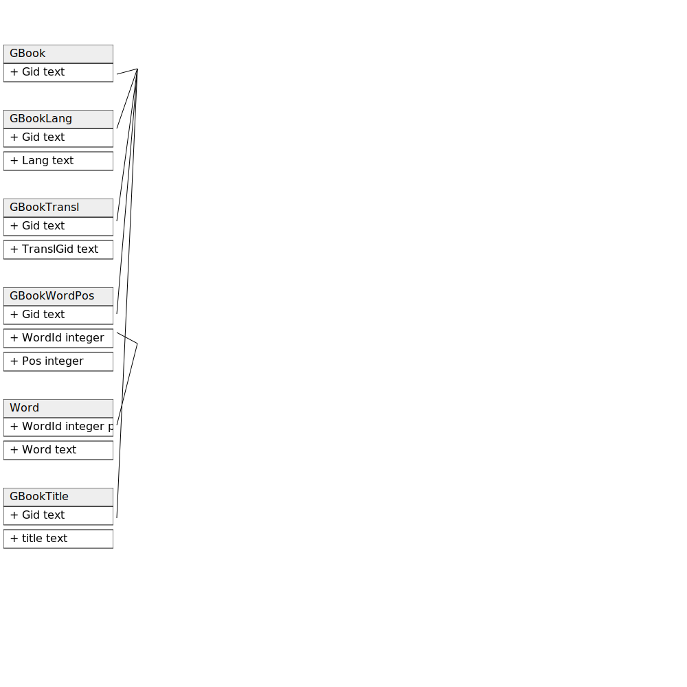

# Sqerli ER Diagram

Create an ER diagram from SQLite SQL by specifying entities in DDL create statements and providing the intended relationships (and rel. cardinality) in a leading comment.

```sh
sqerli "${PWD}/example/example_ddl.sql" -o "${PWD}/example/example_ddl.svg"
```

## How to build

### (fast) build and run using tauri development mode

```
./buildnrun
```

### (slow) build as debug target bundle and run

```sh
RUSTFLAGS="-C link-arg=-fuse-ld=lld" cargo tauri build --debug -b appimage
RUST_BACKTRACE=1 src-tauri/target/debug/bundle/appimage/sqerli_0.1.0_amd64.AppImage "${PWD}/example/example_ddl.sql" -o "${PWD}/example/example_ddl.svg"
```

## Example - Modeling Gutenberg Book Data

### Input: example.sql
https://github.com/koreyhinton/sqerli/blob/5df10313721431f005304a737b9f1a69b1f400f2/example/example_ddl.sql#L1-L12

### Output: example.svg

